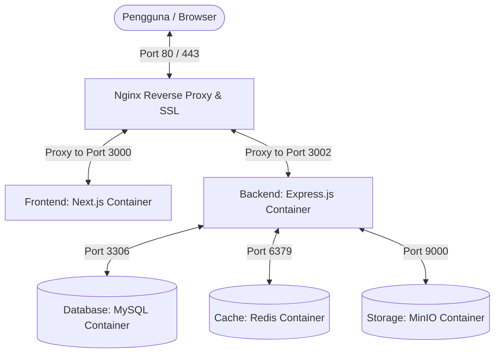

# Panduan Deploy Produksi - AutoService System

Dokumen ini menjelaskan langkah-langkah persiapan dan pelaksanaan deployment aplikasi **AutoService System** (Next.js + Express.js + MySQL + Redis + MinIO) ke lingkungan server produksi menggunakan **Docker Compose** dan **Nginx Reverse Proxy**.

---

## 🏗️ Arsitektur Deployment

Aplikasi ini dideploy menggunakan kontainerisasi Docker untuk menyederhanakan konfigurasi lingkungan:



---

## 📋 Prasyarat Sistem

Sebelum melakukan deployment, pastikan server Anda (VPS Linux seperti Ubuntu 20.04/22.04 LTS) telah memiliki perangkat lunak berikut:

1. **Docker Engine** (v20.10.x atau terbaru)
2. **Docker Compose** (v2.x atau terbaru)
3. **Nginx** (sebagai reverse proxy di sisi host OS)
4. **Domain / Subdomain** yang sudah diarahkan ke IP Publik VPS Anda (misalnya `autoservice.my.id` untuk frontend dan `api.autoservice.my.id` untuk backend).

---

## 🚀 Langkah-Langkah Deployment

### 1. Kloning Repositori ke Server
Kloning repositori kode Anda ke dalam VPS:
```bash
git clone https://github.com/Ediswar03/AutoService.git
cd AutoService
```

### 2. Konfigurasi Environment Variables
Kami telah menyediakan file template `.env.example` di root direktori. Salin file tersebut menjadi `.env`:
```bash
cp .env.example .env
```

Edit file `.env` menggunakan text editor (misalnya `nano` atau `vim`):
```bash
nano .env
```

Sesuaikan variabel penting di bawah ini untuk produksi:
* **`DB_ROOT_PASSWORD` & `DB_PASSWORD`**: Ganti dengan password yang kuat dan aman.
* **`JWT_SECRET` & `JWT_REFRESH_SECRET`**: Ganti dengan string acak yang panjang (misalnya hasil dari `openssl rand -base64 32`).
* **`NEXT_PUBLIC_API_URL`**: Ubah menjadi URL domain publik backend Anda (contoh: `https://api.autoservice.my.id/api/v1`).
* **`GEMINI_API_KEY`**: Masukkan API key Gemini Anda untuk fitur asisten kecerdasan buatan.

> [!IMPORTANT]
> Saat di deploy ke server dengan domain, `NEXT_PUBLIC_API_URL` harus diubah dari `localhost` ke domain backend publik Anda karena dibaca langsung oleh browser klien.

---

### 3. Build dan Jalankan Kontainer Docker
Gunakan Docker Compose untuk membangun image dan menjalankan semua service secara background:
```bash
docker-compose up -d --build
```

Perintah ini akan secara otomatis:
1. Mengunduh image resmi MySQL, Redis, dan MinIO.
2. Membangun image Docker untuk **backend** (menjalankan prisma migration, prisma seeding untuk membuat akun bawaan secara otomatis).
3. Membangun image Docker untuk **frontend** (Next.js) dengan menyematkan url API yang telah dikonfigurasi.
4. Menjalankan semua kontainer dalam jaringan lokal virtual `autoservis-network`.

### 4. Verifikasi Status Kontainer
Pastikan semua kontainer berjalan dengan normal (status `Up` atau `healthy`):
```bash
docker-compose ps
```

Untuk memantau log aplikasi secara real-time jika terjadi error:
```bash
docker-compose logs -f
```

---

## 🔒 Konfigurasi Nginx & SSL (HTTPS)

Gunakan Nginx di server host untuk mengarahkan lalu lintas web (HTTP/HTTPS) ke kontainer Docker dan mengaktifkan enkripsi SSL menggunakan Let's Encrypt.

### 1. Buat Server Block Nginx
Buat file konfigurasi baru di Nginx:
```bash
sudo nano /etc/nginx/sites-available/autoservice
```

Tambahkan konfigurasi berikut (sesuaikan nama domain dengan domain Anda):

```nginx
# 1. Konfigurasi Frontend (autoservice.my.id)
server {
    listen 80;
    server_name autoservice.my.id; # <--- UBAH DENGAN DOMAIN FRONTEND ANDA

    location / {
        proxy_pass http://localhost:3000;
        proxy_http_version 1.1;
        proxy_set_header Upgrade $http_upgrade;
        proxy_set_header Connection 'upgrade';
        proxy_set_header Host $host;
        proxy_cache_bypass $http_upgrade;
    }
}

# 2. Konfigurasi Backend & MinIO Console (api.autoservice.my.id)
server {
    listen 80;
    server_name api.autoservice.my.id; # <--- UBAH DENGAN DOMAIN BACKEND ANDA

    # Backend API
    location / {
        proxy_pass http://localhost:3002;
        proxy_http_version 1.1;
        proxy_set_header Upgrade $http_upgrade;
        proxy_set_header Connection 'upgrade';
        proxy_set_header Host $host;
        proxy_set_header X-Real-IP $remote_addr;
        proxy_set_header X-Forwarded-For $proxy_add_x_forwarded_for;
        proxy_set_header X-Forwarded-Proto $scheme;
    }

    # MinIO File Uploads (Port 9000)
    location /autoservis/ {
        proxy_pass http://localhost:9000;
        proxy_set_header Host $http_host;
        proxy_set_header X-Real-IP $remote_addr;
        proxy_set_header X-Forwarded-For $proxy_add_x_forwarded_for;
        proxy_set_header X-Forwarded-Proto $scheme;
    }
}
```

### 2. Aktifkan Konfigurasi & Reload Nginx
Buat symbolic link ke folder `sites-enabled` dan uji konfigurasinya:
```bash
sudo ln -s /etc/nginx/sites-available/autoservice /etc/nginx/sites-enabled/
sudo nginx -t
```
Jika tidak ada error, lakukan reload Nginx:
```bash
sudo systemctl reload nginx
```

### 3. Dapatkan SSL Gratis dari Let's Encrypt
Gunakan Certbot untuk menginstal sertifikat SSL otomatis:
```bash
sudo apt update
sudo apt install certbot python3-certbot-nginx -y
sudo certbot --nginx -d autoservice.my.id -d api.autoservice.my.id
```
Ikuti instruksi di layar dan pilih opsi untuk mengalihkan (redirect) semua lalu lintas HTTP ke HTTPS otomatis.

---

## 🔑 Kredensial Bawaan (Default Accounts)

Setelah kontainer backend berjalan pertama kali, database akan terisi otomatis dengan akun berikut (berdasarkan file `seed.ts`):

| Peran (Role) | Email | Password Bawaan |
| :--- | :--- | :--- |
| **Administrator** | `admin@autoservis.com` | `admin123` |
| **Mekanik** | `mekanik@autoservis.com` | `mekanik123` |
| **Petugas Gudang** | `gudang@autoservis.com` | `gudang123` |
| **Pimpinan** | `pimpinan@autoservis.com` | `pimpinan123` |

> [!WARNING]
> Harap segera login dan mengganti password default ini di halaman profil masing-masing pengguna demi keamanan sistem Anda.

---

## 🛠️ Perawatan & Perintah Tambahan

### Memperbarui Aplikasi (Update Deploy)
Setiap kali ada perubahan kode di repositori lokal dan Anda ingin memperbaruinya di server:
```bash
git pull origin main
docker-compose up -d --build
```

### Menghapus Seluruh Layanan (Clean Down)
Untuk menghentikan kontainer tanpa menghapus data database/storage:
```bash
docker-compose down
```

Untuk menghentikan kontainer sekaligus menghapus seluruh volume data (database akan terhapus):
```bash
docker-compose down -v
```

### Mengakses Prisma Studio di Server
Jika Anda ingin memeriksa database secara visual lewat browser melalui server produksi:
1. Pastikan port 5555 dibuka sementara.
2. Jalankan perintah:
   ```bash
   docker-compose exec backend npx prisma studio --port 5555 --hostname 0.0.0.0
   ```
3. Buka browser dan akses `http://ip-server-anda:5555`.

### Backup Database Manual
Untuk melakukan backup database MySQL di luar host OS:
```bash
docker-compose exec db mysqldump -u root -p[PASSWORD_ROOT_ANDA] autoservis > backup.sql
```
